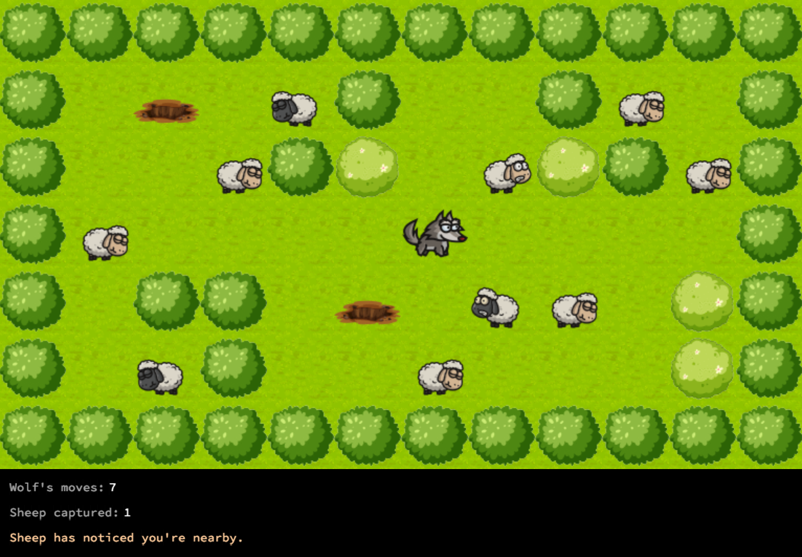

<div align="center">
  
</div>

# So Long
This project is a very small 2D game. Its purpose is to work with textures, sprites, and some other very basic gameplay elements.

## Table of Contents
- [Installation](#installation)

## Installation
To play So Long, follow these steps.

1. Clone the repository:
https://github.com/iwonawo/42-so_long.git

2. Update path to the library depending on the system you're using:

In file so_long.h use:</br>
for Mac
```c
# include "mlx/mlx.h"
```

for Linux
```c
# include "mlx-lin/mlx.h"
```

3. To compile the project, run the following command:

mandatory part:
```bash
make
```

bonus part:
```bash
make bonus
```

4. To start the game, run the following command. You can choose one of the existing maps or create a new one (with .ber extension)

Example for mandatory part:
```bash
./so_long ./assets/maps/map.ber
```

Example for bonus part:
```bash
./so_long_bonus ./assets_bonus/maps/map.ber
```

### How to play:

| Key | Action |
|---|---|
| <kbd>W</kbd>, <kbd>↑</kbd>| Up |
| <kbd>S</kbd>, <kbd>↓</kbd>| Down |
| <kbd>A</kbd>, <kbd>←</kbd>| Left |
| <kbd>D</kbd>, <kbd>→</kbd>| Right |
| <kbd>ESC</kbd>, `⎋`| Close the game |
---

### Map example:

Mandatory part:
```
111111111111
1E10C1001C01
100C110C11C1
1C000CC00001
1011000CC011
1CC10CC000P1
111111111111
```

Bonus part:
```
111111111111
1E10C1001C01
100C110C11C1
1C00TCC00001
1011000CC011
1CC10CCT00P1
111111111111
```